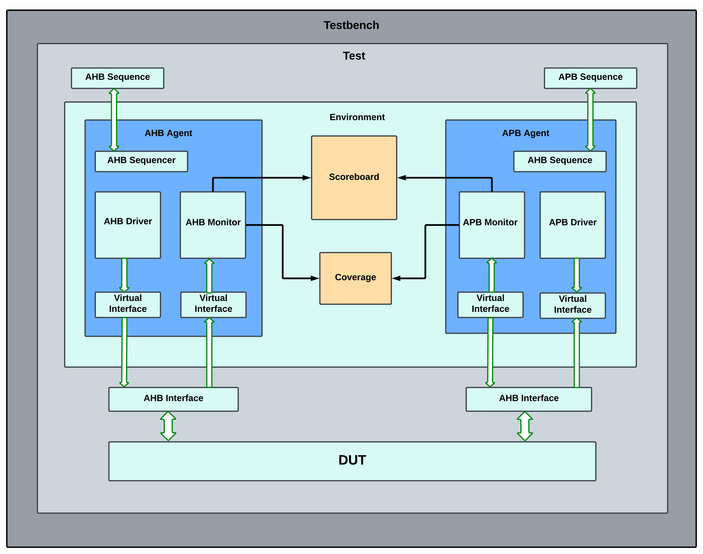

# AHB3Lite to APB Bridge Verification ✅

This repository provides a **UVM-based verification environment** for an **AHB3Lite to APB bridge**. The bridge converts AHB3Lite transactions into APB transactions, enabling communication between high-performance masters and low-power peripheral devices.

The design is taken from another repository. You can find the original implementation here:  
**[[Insert Link Here](https://github.com/RoaLogic/ahb3lite_apb_bridge)]**

---

## Overview ✅

### AHB3Lite to APB Conversion
The **AHB3Lite bus** is a simplified version of AMBA AHB, designed for high-performance memory-mapped communication. The **APB bus** is optimized for low-power peripheral access. This bridge translates AHB3Lite transactions into APB-compatible signals while ensuring proper handshaking and control flow.

**AHB3Lite to APB Bridge Diagram:**  


---

## Clock Domain Crossing (CDC) ✅

Since AHB3Lite and APB often operate at different clock speeds, **Clock Domain Crossing (CDC)** is a crucial aspect of this bridge design. The synchronization mechanism ensures reliable data transfer between the two domains:

- **AHB Side (Fast Clock Domain)**: Transactions arrive at a higher frequency.
- **APB Side (Slow Clock Domain)**: Operates at a lower frequency with a simple request-response protocol.
- **Synchronization Registers (`SYNC_DEPTH` = 3)**: A set of flip-flops is used to safely transfer signals across clock domains.
- **Handshake Mechanism**: Ensures that AHB transactions are correctly latched and forwarded when the APB interface is ready.

By implementing these techniques, the bridge prevents metastability and ensures **data integrity** between the two clock domains.

---

## UVM-Based Testbench ✅

A **Universal Verification Methodology (UVM)** testbench has been developed to verify the bridge functionality.

**UVM Testbench Diagram:**  


### Testbench Components:
- **AHB Agent**: Mimics the behavior of an **AHB Master**, generating transactions and monitoring responses.
- **APB Agent**: Mimics the behavior of an **APB Slave**, capturing transactions and checking correctness.
- **Scoreboard**: Compares expected and actual APB transactions.
- **Coverage**: Ensures all bridge functionalities are tested.
- **Randomized and Directed Test Cases**: Validate different transaction patterns and corner cases.

---

## Test Cases ✅

To ensure **comprehensive verification**, various test scenarios are implemented, including:

1. **Single Write**: A basic AHB write operation and its conversion to an APB write.
2. **Single Read**: AHB read request and APB response validation.
3. **Successive Writes**: Multiple write operations to test back-to-back transactions.
4. **Successive Reads**: Consecutive read operations ensuring proper response timing.
5. **Back-to-Back Read & Write**: Alternating read and write operations to check pipeline efficiency.
6. **Transfers with Different Sizes**: Verification using different **transfer sizes** (`byte`, `half-word`, `word`, etc.).
7. **Burst Transfers**: Testing bridge behavior under **incrementing and wrapping bursts**.
8. **Transfers with Wait States**: Adding delays to test bridge performance under **slow APB responses**.

Each test scenario ensures the bridge properly **converts, synchronizes, and handles various traffic patterns** between AHB and APB.

---

## Configuration ✅

The bridge supports configurable bus widths and synchronization depth to adapt to different system requirements:

- **Bus Widths:**
  - `HADDR_SIZE = 32` → AHB3Lite address bus width (bits).
  - `HDATA_SIZE = 32` → AHB3Lite data bus width (bits).
  - `PADDR_SIZE = 10` → APB address bus width (bits).
  - `PDATA_SIZE = 8` → APB data bus width (bits).

- **Synchronization Depth:**
  - `SYNC_DEPTH = 3` → Defines the depth of synchronization registers for crossing clock domains.

These parameters can be modified in `bridge_pkg.sv` to suit different design requirements.

---

## Running the Simulation ✅

1. Clone this repository:
   ```sh
   git clone [Repo Link]
   cd ahb3lite-to-apb-bridge-verification
